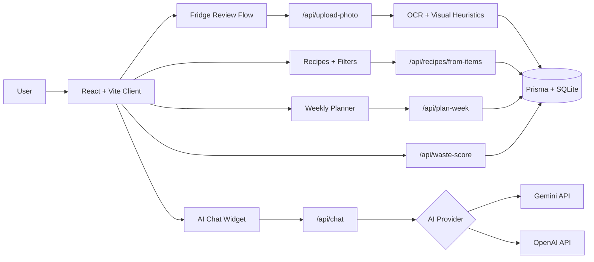

# WasteNotChef
live URL: https://waste-not-chef.vercel.app

WasteNotChef is an AI-powered fridge intelligence app that turns ingredients on hand into recipes, weekly meal plans, and lower-waste cooking decisions.

[](https://waste-not-chef.vercel.app)


Live app: [https://waste-not-chef.vercel.app](https://waste-not-chef.vercel.app)

## Product Preview
Current captured preview:
- Landing page with camera-first upload hero, planner CTA, and AI chat button

To embed the screenshot directly in this README, save the attached image into the repo, for example:
- `docs/images/landing-preview.png`

Then add:
```md

```

Recommended files:
- `docs/images/login.png`
- `docs/images/fridge-review.png`
- `docs/images/recipes.png`
- `docs/images/planner.png`
- `docs/images/chat.gif`

Suggested capture order:
1. Login or guest entry
2. Fridge review with detected and manual items
3. Recipes with filters and `Show recipe`
4. Planner with saved meals
5. AI chat in action

## What It Does
- Upload a fridge photo with a camera-first flow
- Detect visible ingredients using OCR plus lightweight visual heuristics
- Let users manually correct or add missing pantry items
- Generate recipe suggestions from the latest fridge state
- Filter recipes by `All`, `Country`, and `Continent`
- Prioritize a broader set of Indian recipes and pantry-relevant matches
- Add recipes to a weekly planner for later
- Open recipes inline for step-by-step cooking right away
- Chat with an in-app AI assistant powered by Gemini or OpenAI

## Why I Built It
I built WasteNotChef to solve a very common problem: people already have food at home, but they still do not know what to cook first, what is about to go bad, or how to turn random fridge items into a plan. The product combines fridge scanning, pantry correction, recipe generation, planning, and AI assistance into one focused experience.

## Product Highlights
- React + Vite + TypeScript frontend with Tailwind and Framer Motion
- Express + TypeScript backend with Prisma + SQLite
- Deterministic fridge analysis pipeline with explainable OCR/date handling
- Quest-style planner UX with drag and drop day cards
- Manual pantry editing, refresh-safe persistence, and guest/local session flow
- Notification preferences UI with browser permission support
- Deploy-ready setup for Vercel + Render

## Feature Overview
| Feature | What it does |
| --- | --- |
| Camera-first fridge scan | Upload a fridge photo and extract likely ingredients from OCR plus visual heuristics |
| Manual pantry correction | Add missing items, fix expiry dates, and keep the inventory accurate |
| Fresh recipe generation | Generate recipes from the latest fridge state with a dedicated `Get Recipes` action |
| Geography filters | Browse recipes by `All`, `Country`, and `Continent` |
| Indian recipe depth | Surface more Indian breakfasts, curries, sabzis, rice dishes, dals, and snacks |
| Weekly planner | Save recipes for later and organize them in a quest-style planner |
| Cook-now recipe view | Open steps and a related YouTube search directly inside the recipe card |
| AI chat | Ask Gemini or OpenAI-powered questions about recipes, substitutions, storage, or planning |

## Built With AI
- Used Codex to design and implement the full-stack product workflow
- Iterated on fridge detection, recipe ranking, planner logic, persistence, and deployment
- Added provider-based AI chat with Gemini or OpenAI support through a backend proxy
- Refined the UX through multiple feedback-driven changes across recipes, planner, login, and settings

## Tech Stack
- Client: React, Vite, TypeScript, Tailwind CSS, Framer Motion
- Server: Node.js, Express, TypeScript
- Database: Prisma, SQLite
- OCR: Tesseract.js
- Scheduling: deterministic EDF-style weekly planning
- Notifications: browser permission flow, backend reminder stubs
- AI chat: Gemini or OpenAI through a backend proxy route

## Architecture


## Quick Start
1. Copy `.env.example` to `.env`
2. Copy `client/.env.example` to `client/.env`
3. Install dependencies
   - `npm install`
   - `npm install --prefix client`
4. Set up the database
   - `npx prisma migrate dev --name init`
   - `npm run prisma:seed`
5. Start the app
   - `npm run dev`
6. Open `http://localhost:5173`

## Useful Commands
- `npm run dev` starts server and client together
- `npm run build` builds server and client
- `npm test` runs the test suite
- `npm run prisma:seed` reseeds ingredients and recipes

## AI Chat Setup
The app includes an in-product AI chat widget.

Use Gemini:
- `AI_PROVIDER=gemini`
- `GEMINI_API_KEY=your_key_here`
- optional `GEMINI_MODEL=gemini-2.5-flash`

Use OpenAI:
- `AI_PROVIDER=openai`
- `OPENAI_API_KEY=your_key_here`
- optional `OPENAI_MODEL=gpt-4.1-mini`

The AI provider key should be added only on the backend deployment, not in the client.

## Deployment
Recommended:
- Frontend on Vercel
- Backend on Render

### Render
- Deploy the repo root
- Build command:
  - `npm install && npx prisma generate && npm run build:server`
- Start command:
  - `npx prisma db push && npm run prisma:seed && node dist/src/index.js`
- Required env:
  - `DATABASE_URL=file:./prisma/dev.db`
  - `CLIENT_URLS=https://your-vercel-url.vercel.app`
- For AI chat with Gemini:
  - `AI_PROVIDER=gemini`
  - `GEMINI_API_KEY=...`
  - `GEMINI_MODEL=gemini-2.5-flash`

### Vercel
- Set project root to `client`
- Add:
  - `VITE_API_BASE_URL=https://your-render-url.onrender.com/api`

## Current UX Flow
1. Sign in locally or continue as guest
2. Upload a fridge image
3. Review detected items and manually add anything missing
4. Click `Get Recipes` to generate fresh recommendations from the latest fridge items
5. Use `Show recipe` to cook now or `Add to plan` to save it for later
6. Adjust the weekly planner and ask the AI chat for help with substitutions, recipes, or storage

## Demo Notes
- `Show recipe` is for cooking immediately
- `Add to plan` is for saving recipes into the planner for later
- Manual pantry additions persist across refresh
- Recipe generation always uses the latest fridge state when `Get Recipes` is clicked

## Limitations
- Fridge detection is still a hybrid OCR plus heuristic pipeline, not a true vision model
- Expiry dates are usually inferred unless readable packaging text is visible
- SQLite is fine for demos and lightweight usage, but Postgres would be better for scale

## Next Improvements
- Replace heuristic fridge recognition with a real vision model
- Add shopping list generation from missing recipe ingredients
- Add shared household mode and collaborative planning
- Add saved recipes and scan history
- Add streaming AI chat responses and richer pantry-aware tool use
